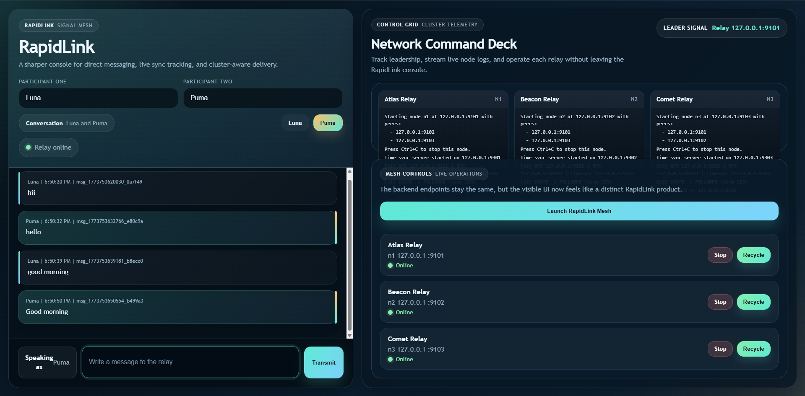
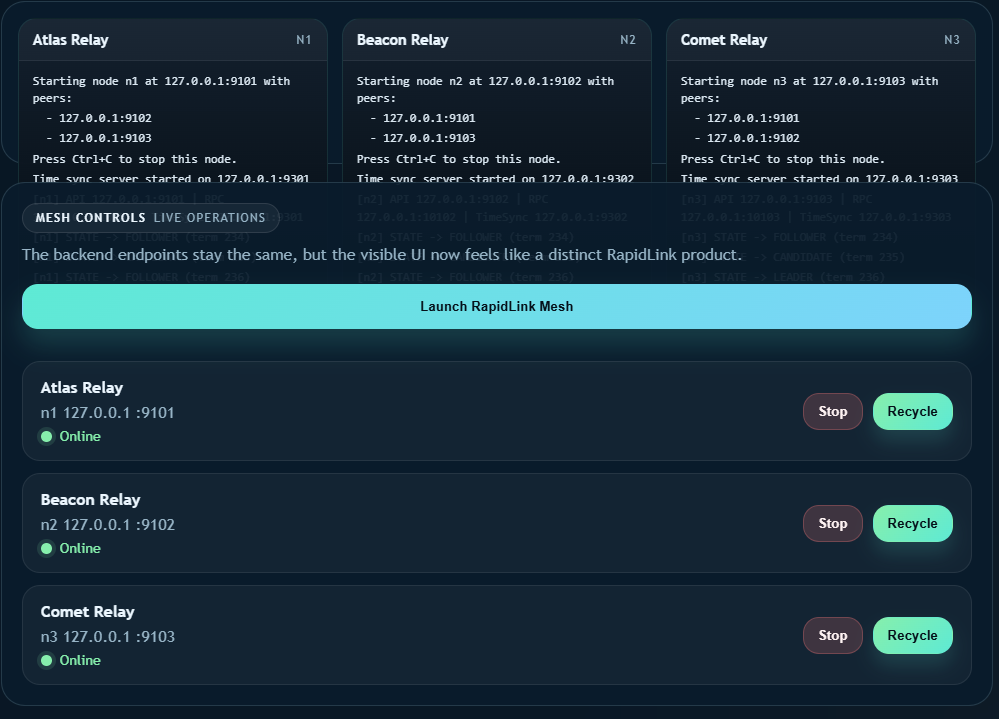

# RapidLink

RapidLink is a distributed messaging system built in Python for local multi-node execution. It combines Raft-based leader election and replication, durable message logs, direct messaging APIs, time synchronization utilities, and a browser-based control console.

The project is designed to run without Kafka, Docker, or any external broker. A FastAPI gateway starts and manages the cluster, streams node terminal output to the browser, and exposes REST and WebSocket flows for direct messaging and live updates.

## Highlights

- Multi-node cluster with start, kill, and restart controls
- Raft-based leader election, heartbeats, and log replication
- Durable commit logs with deduplication support
- Direct messaging conversations with history retrieval
- FastAPI gateway with REST endpoints and WebSocket streaming
- Browser UI for cluster control, message history, and live terminals
- Physical time sync, Lamport clocks, and message ordering helpers
- Unit and integration tests for cluster, replication, API, and time modules

## Project Structure

- `src/cluster/` - node runtime, RPC, Raft, heartbeats, and failure detection
- `src/replication/` - persistent commit log, dedup cache, and replication helpers
- `src/api/` - wire protocol handling and direct message topic helpers
- `src/time/` - time synchronization, Lamport clocks, and ordering utilities
- `scripts/dm_gateway.py` - FastAPI gateway and browser UI entry point
- `scripts/run_node.py` - run one node by id
- `scripts/run_cluster.py` - start the full cluster locally
- `scripts/failover_demo.py` - demonstrate leader failover and recovery
- `public/` - web UI assets and screenshots
- `tests/` - unit and integration coverage

## Default Cluster Layout

The default cluster is defined in `config/cluster.yaml`:

- `n1` -> `127.0.0.1:9101`
- `n2` -> `127.0.0.1:9102`
- `n3` -> `127.0.0.1:9103`

Each node also opens:

- an RPC port on `node_port + 1000`
- a time sync port on `node_port + 200`

## Screenshots

### Gateway UI



### Live Node Terminals



## Setup

1. Create a virtual environment.

```bash
python -m venv .venv
```

2. Activate it.

```bash
source .venv/bin/activate
```

PowerShell:

```powershell
.venv\Scripts\Activate.ps1
```

3. Install dependencies.

```bash
pip install -r docs/requirements.txt
```

## Run The Project

### Option 1: Start the gateway and web UI

```bash
python scripts/dm_gateway.py
```

Then open:

```text
http://localhost:8081/
```

From the UI you can:

- start the configured cluster
- kill or restart individual nodes
- watch each node's terminal output live
- send direct messages and inspect history

### Option 2: Run a single node

```bash
python scripts/run_node.py --id n1
```

Optional arguments:

- `--config` to use a different cluster config file
- `--data-root` to choose a different storage directory

### Option 3: Run the local cluster script

```bash
python scripts/run_cluster.py
```

This starts all configured nodes, checks inter-node communication, and reports leader election status.

### Option 4: Run the failover demo

```bash
python scripts/failover_demo.py
```

This script starts a small cluster, publishes before and after failover, cancels the current leader, waits for a new leader, then restarts the old node and verifies history recovery.

## Data And Logs

By default, runtime data is written under `.data/`.

Typical node artifacts include:

- `.data/<node_id>/logs/console.log`
- `.data/<node_id>/logs/node.log`
- `.data/<node_id>/logs/metrics.log`
- `.data/<node_id>/raft/`

The gateway reads the console logs to stream the browser terminals in real time.

## Messaging Flow

RapidLink supports leader-based publish and history retrieval over the node wire protocol and through the FastAPI gateway.

Main operations include:

- `PUB` for publishing a message
- `SUB` for subscribing to a topic
- `HISTORY` for reading committed message history
- direct-message conversation ids generated from two participant names

The gateway converts browser actions into broker commands and returns structured responses for message history and live updates.

## Time Synchronization

The project also includes time coordination features for distributed message ordering:

- SNTP-style offset measurement
- per-node time sync server and client
- Lamport clock support
- vector-clock-aware helpers
- bounded message reordering utilities

Demo code for this lives in `src/demos/time_sync_demo.py`.

## Testing

Run the test suite with:

```bash
pytest tests -q
```

The repository includes tests for:

- config loading
- API and gateway helpers
- RPC communication
- Raft election and replication
- commit log persistence
- time synchronization and logical clocks
- integration behavior across nodes

## Environment Notes

Optional environment variables include:

- `GATEWAY_PORT` to change the web UI and API port
- `BROKER_HOST` and `BROKER_PORT` to point the gateway at a primary node
- `BROKER_NODES` to provide a fallback list of node addresses
- `NODE_DATA_ROOT` to change where node runtime data is stored

You can also place a local `.env` file in the project root. The gateway loads simple `KEY=VALUE` pairs on startup.
